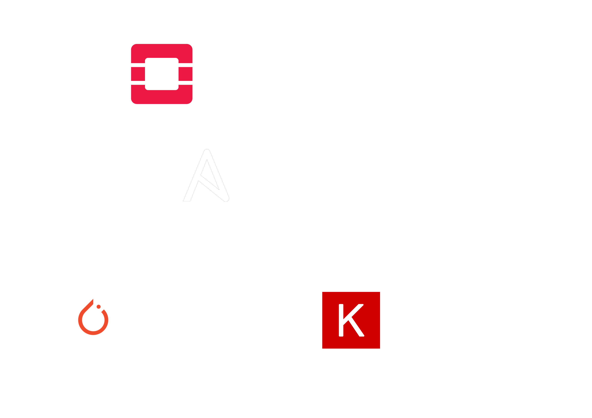

# Life of Py
### A perspective on Python's role in the devops world

<!--
Short introduction of me and the topic - Python's strengths and weaknesses in a devops context.

Whoami: Worked in the IT industry for ten years. Been wearing many different hats, but lots of
focus on security and devops with emphasis on ops.

Topic: What makes Python a usable tool in the devops context? What makes it a good and bad choice?

Brasklapp: These opinions have been formed by years of experience, but are still subjective.
-->

---
<!-- _footer: "Logotype usage is restricted by trademark" -->


<!--
Many popular products, services and open source projects are powered by Python.
This slide contains FOSS examples especially relevant for this context.

OpenStack is a suite of projects that enables everyone (with a bit of effort) to become their own
cloud provider like AWS and Azure.

Ansible and SaltStack are two very popular configuration management frameworks commonly used to
manage large fleet of servers and networking equipment. Python knowledge is essential for extending
their capabilities.

PyTorch and Keras are two of the most used frameworks for machine/deep learning. Python has become
the defacto language used by the ML community.
-->

---
## Pleasant syntax and libraries

```python
import requests

response = requests.get("https://ifconfig.co/json").json()
print("My external address is " + response["ip"])

if response["country_eu"]:
    print("Looks like I'm in the European Union!")
```

<!--
Python is a quite expressive yet easy to read programming language. Besides very efficient syntax,
the standard library and collaboration sites such as PyPi provides a lot of ready-to-use code
under free software licenses. The community values standardised code formatting and many APIs
look and behave similar, which enables developers to quickly get benefit from them.
-->

---
```python
#!/usr/bin/env python3
from argparse import ArgumentParser

argument_parser = ArgumentParser(
    description = "Utility to calculate caffeine consumption",
    epilog = "Drink responsibly")

argument_parser.add_argument(
    "-c", "--cups", type = int, required = True,
    help = "Number of cups consumed during the day")

argument_parser.add_argument(
    "-v", "--verbose", action = "store_true",
    help = "Enable detailed calculation logs")

arguments = argument_parser.parse_args()
```

<!--
On of the areas where Python is heavily used is in command line utilities and developer tooling.
The language and standard library makes writing these types of programs a breeze - mayhaps that's
why many SDKs such as boto3 for AWS promotes Python as a first class citizen. 
-->

---
```
$ caffeine_calculator --help

usage: caffeine_calculator [-h] -c CUPS [-v]

Utility to calculate caffeine consumption

options:
  -h, --help            show this help message and exit
  -c CUPS, --cups CUPS  Number of cups consumed during the day
  -v, --verbose         Enable detailed calculation logs

Drink responsibly
```

```
$ caffeine_calculator -v

usage: caffeine_calculator [-h] -c CUPS [-v]
caffeine_calculator: error: the following arguments are required: -c/--cups
```

---
## Great for testing and prototyping
```python
from flask import Flask, request
from markupsafe import escape

app = Flask("prototype_webapp")

@app.route("/greeter/<user_name>")
def greet_user(user_name):
    return "Hi there, " + escape(user_name)

@app.route("/api/request_info")
def request_information():
    return {
        "ip_address": request.remote_addr,
        "browser": request.headers["User-Agent"]}
```

<!--
While perhaps not the best choice today for production systems (more about that later), it's a
great fit for fast prototyping. By just being plain text files instead of binaries, it makes
sharing code and implementing ad-hoc fixes easy.

Flask is a great tool for creating basic web applications quickly, as seen in the example.
We've basically recreated a lot of the code for the backend web service used in our first example.
-->

---
```
$ flask --app prototype_webapp run

* Serving Flask app 'prototype_webapp'
* Debug mode: off
* Running on http://127.0.0.1:5000
```

```
$ curl http://localhost:5000/greeter/Janne

Hi there, Janne
```

```
$ curl http://localhost:5000/api/request_info | jq

{
  "browser": "curl/7.81.0",
  "ip_address": "127.0.0.1"
}
```

---
## Other yays
(Mostly) cross platform and memory safe

<!--
As simple Python applications are often just a bunch of text files that are parsed by the
interpreter, we typically don't need to care about the underlying operating system or CPU
architectures.

While Python is far from unique these days in providing automatic memory management, a nice
benefit besides simpler code is the eradication of vulnerabilities such as stack and buffer
overflows.

Everything is however not just roses.
-->

---
> Python is a language that enables programmers to develop and deploy
> broken code at record speeds. Shortest time-to-debug in the industry!

— *Intoxicated but unusually wise man at a conference*

<!--
While Python is quick and pleasant to read/write, developing reliable and predictable applications
is not as easy. Python does not enforce strict type checking, which among other things can result
in interesting behavior when unexpected data (or the lack of it) is handled by functions.

The Python (or more specifically cpython) interpreter actually does quite little checking before
starting a program. Did you forget to set variable or specify a typo? Did your code after years
of smooth operation suddenly run into an elif that lead to a broken and untested code path? These
are things that the Go or Rust compiler would nag you about before even building your code, but
Python developers have to rely on third-party tools that do a lot of guess work.

The community realises that these problems exist and features such as type hinting have been added
to make things slightly less terrible. In technology it is however often hard to bolt on these
type of restrictions if not included in the original design.
-->

---
## Distribution challenges
How do you make sure that end-users and other developers are
using the same software versions and dependencies as you?

<!--
You would think that sharing a bunch of plain text files would be easy, but it's a bit more
complicated than that.

First off, you need a Python runtime to execute programs. The Python language and standard library
are always evolving - new syntax is being introduced that older versions of the interpreter don't
understand. While you could try to avoid using these fancy features, maybe your dependencies do?
While the language is suppose to be at least backwards compatible, this was not the case from
version 2 to 3 - thankfully that debacle is mostly behind us.

Instructing the users to install the right version of the runtime may not be trivial and could
conflict with a version provided by the operating system.

You also often import third-party modules as dependencies that need to be installed on the system.
How is this done and which version are even used? Do they conflict with ones provided by other
applications or the operating system itself?

All dependencies are not just pure Python modules. Quite commonly modules are implemented in C
for increased performance and efficiency. This is a nice feature, but means that code needs to be
natively compiled for all the various operating systems and CPU architectures your program might 
depend on. Remember that dependencies often have dependencies themselves, so just because you avoid
these features might not mean that others have. Your program may even depend on other programs
written in completely different languages.

These issues doesn't only make it painful to distribute your application to end-users, but also
to other developers - you wanna make sure that your development environment behaves the same way
as your peers'.

Many newer languages have opted for more restricted build environments and fat static dependencies
that don't depend on any code or versions on the target system.
-->

---
## Some solutions
- [Virtual environments ("venv")](https://docs.python.org/3/tutorial/venv.html)
- [PyInstaller](https://pyinstaller.org/) or [py2exe](https://www.py2exe.org/)
- Containers ([Docker/OCI](https://opencontainers.org/), [Snap](https://snapcraft.io/), etc.)

<!--
There have been several attempts to solve these issues with their own pros and cons.

Among Python developers, virtual environment are quite popular. They basically allow you to
somewhat isolate your code from other applications on the system by installing dependencies in a
separate directory for each application. Distributing a virtual environment is however not trivial,
so it's mostly a development tool.

PyInstaller and the older py2exe projects attempt to bundle the interpreter, all code,
dependencies and assets in a single executable file - think exe on Windows or ELF on Linux.
While quite neat when they work, there are a lot of if and buts - more often than not things will
mysteriously break due to "shadow dependencies" as Python was not designed for this type of usage.
Furthermore you often need to run the tools on each target platform you want your application to
run on (mainly due to dependencies on libc versions and similar), so your build environment may
become quite complex.

More popular during the last couple of years is to bundle everything required to run your
application into a container image - so called Docker containers are probably the most common
method. If you haven't used Docker containers, an analogy may be a preconfigured virtual machine.
While quite neat, this solution is mostly applicable to servers (Linux and Windows) and the 
tiny (but maybe relevant for devops tooling) Linux desktop market.
-->

---
```dockerfile
FROM python:3.11.0

RUN pip install Flask==2.2.2
COPY prototype_webapp.py .

USER 10000
CMD ["flask", "--app", "prototype_webapp", "run", "--host", "0.0.0.0"]
```

```
$ docker build -t prototype_webapp:1.0 -f Containerfile .
```

```
$ docker run prototype_webapp:1.0

* Serving Flask app 'prototype_webapp'
* Debug mode: off
* Running on all addresses (0.0.0.0)
```

<!--
This examples shows us how to build and run a Docker container for prototype webapp.
We base the container image on the official Python image and specify a version so we know what
runtime will be used. Pip is used inside of the container to install our third-party dependencies -
in this case that Flask package from PyPi.

The application code is copied into the container and we specify a command to be run when the
container is executed. A UID is specified for the user as we don't want to run the application as
root for security reasons - ask questions about this if your interested in more details.
-->

---
## Other nays
Non-amazing performance and efficiency (especially memory)

<!--
While it may or may not be relevant for your application, Python is not known for it's amazing
performance. Due to things like usage of global locks an garbage collection by the interpreter,
memory usage is neither especially fast or efficient.

More modern languages typically have better multi-processing primitives as well that make it easy
to fully utilize multi-core systems - a good example is "goroutines" in Go.
-->

---
## A note about [PyPi](https://pypi.org/)
Most of the 415 098 packages are well raised and god-fearing, but not all.

<!--
Last but not least, I wanna raise a finger in warning regarding usage of third-party modules from
sites like PyPi or Github.

While these FOSS communities are a lot of the reason why using Python is great, there are actors
out there who are trying to use these repositories to distribute malicious code.

As Python modules can contain arbitrary code, inclusion of a module means that your security
is depends on the modules security.

Everyday attempts to hack developers accounts on these sites are performed and sometimes succeed.
Furthermore some actors use methods like typo squatting to infect users that fat finger install
commands.

It should however be noted that these risks are not unique to Python, but all software
repositories to varying extent.
-->

---


For presentation notes, example code and similar, see:   
**[talks.radartatska.se/lopy.zip](https://talks.radartatska.se/lopy.zip)**  
  
**Thanks for listening!**
